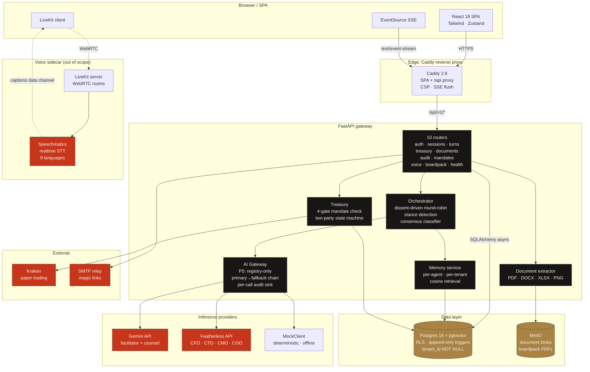
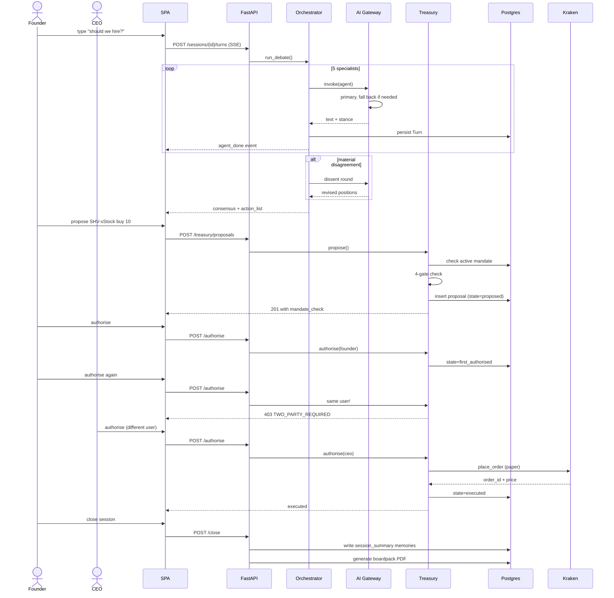
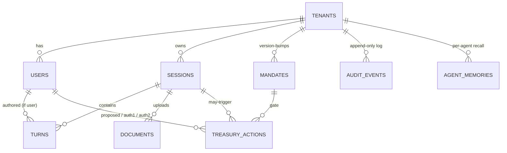
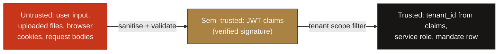

# ATRIO Architecture

## Component diagram

```mermaid
graph TB
    subgraph Browser["Browser / SPA"]
        UI[React 18 SPA<br/>Tailwind · Zustand]
        SSE[EventSource SSE]
        LK_CLIENT[LiveKit client]
    end

    subgraph Edge["Edge: Caddy reverse proxy"]
        CADDY[Caddy 2.8<br/>SPA + /api proxy<br/>CSP · SSE flush]
    end

    subgraph API["FastAPI gateway"]
        ROUTERS[10 routers<br/>auth · sessions · turns<br/>treasury · documents<br/>audit · mandates<br/>voice · boardpack · health]
        ORCH[Orchestrator<br/>dissent-driven round-robin<br/>stance detection<br/>consensus classifier]
        GATEWAY[AI Gateway<br/>P5: registry-only<br/>primary→fallback chain<br/>per-call audit sink]
        TREASURY[Treasury<br/>4-gate mandate check<br/>two-party state machine]
        DOCS[Document extractor<br/>PDF · DOCX · XLSX · PNG]
        MEMORY[Memory service<br/>per-agent · per-tenant<br/>cosine retrieval]
    end

    subgraph Providers["Inference providers"]
        GEMINI[Gemini API<br/>facilitator + counsel]
        FEATHER[Featherless API<br/>CFO · CTO · CMO · COO]
        MOCK[MockClient<br/>deterministic · offline]
    end

    subgraph Data["Data layer"]
        PG[(Postgres 16 + pgvector<br/>RLS · append-only triggers<br/>tenant_id NOT NULL)]
        MINIO[(MinIO<br/>document blobs<br/>boardpack PDFs)]
    end

    subgraph Voice["Voice sidecar (out of scope)"]
        LK_SERVER[LiveKit server<br/>WebRTC rooms]
        STT[Speechmatics<br/>realtime STT<br/>9 languages]
    end

    subgraph External["External"]
        KRAKEN[Kraken<br/>paper trading]
        SMTP[SMTP relay<br/>magic links]
    end

    UI -->|HTTPS| CADDY
    SSE -->|text/event-stream| CADDY
    LK_CLIENT -.WebRTC.-> LK_SERVER
    CADDY -->|/api/v1/*| ROUTERS
    ROUTERS --> ORCH
    ROUTERS --> TREASURY
    ROUTERS --> DOCS
    ORCH --> GATEWAY
    ORCH --> MEMORY
    GATEWAY --> GEMINI
    GATEWAY --> FEATHER
    GATEWAY --> MOCK
    TREASURY --> KRAKEN
    ROUTERS -->|SQLAlchemy async| PG
    MEMORY --> PG
    DOCS --> MINIO
    TREASURY --> PG
    ROUTERS --> SMTP
    LK_SERVER --> STT
    STT -.captions data channel.-> LK_CLIENT

    classDef api fill:#171615,stroke:#cfc8bd,color:#f7f4ee
    classDef data fill:#a98244,stroke:#615b53,color:#f7f4ee
    classDef ext fill:#c7361b,stroke:#615b53,color:#f7f4ee
    class ROUTERS,ORCH,GATEWAY,TREASURY,DOCS,MEMORY api
    class PG,MINIO data
    class GEMINI,FEATHER,KRAKEN,SMTP,STT ext
```

## Sequence: full demo flow

```mermaid
sequenceDiagram
    actor F as Founder
    actor C as CEO
    participant UI as SPA
    participant API as FastAPI
    participant ORCH as Orchestrator
    participant GW as AI Gateway
    participant TS as Treasury
    participant DB as Postgres
    participant K as Kraken

    F->>UI: type "should we hire?"
    UI->>API: POST /sessions/{id}/turns (SSE)
    API->>ORCH: run_debate()
    loop 5 specialists
        ORCH->>GW: invoke(agent)
        GW->>GW: primary, fall back if needed
        GW-->>ORCH: text + stance
        ORCH->>DB: persist Turn
        ORCH-->>UI: agent_done event
    end
    alt material disagreement
        ORCH->>GW: dissent round
        GW-->>ORCH: revised positions
    end
    ORCH-->>UI: consensus + action_list
    F->>UI: propose SHV-xStock buy 10
    UI->>API: POST /treasury/proposals
    API->>TS: propose()
    TS->>DB: check active mandate
    TS->>TS: 4-gate check
    TS->>DB: insert proposal (state=proposed)
    TS-->>UI: 201 with mandate_check
    F->>UI: authorise
    UI->>API: POST /authorise
    API->>TS: authorise(founder)
    TS->>DB: state=first_authorised
    F->>UI: authorise again
    UI->>API: POST /authorise
    API->>TS: same user!
    TS-->>UI: 403 TWO_PARTY_REQUIRED
    C->>UI: authorise (different user)
    UI->>API: POST /authorise
    API->>TS: authorise(ceo)
    TS->>K: place_order (paper)
    K-->>TS: order_id + price
    TS->>DB: state=executed
    TS-->>UI: executed
    F->>UI: close session
    UI->>API: POST /close
    API->>DB: write session_summary memories
    API->>DB: generate boardpack PDF
```

## Data model (key relationships)

```mermaid
erDiagram
    TENANTS ||--o{ USERS : "has"
    TENANTS ||--o{ SESSIONS : "owns"
    TENANTS ||--o{ MANDATES : "version-bumps"
    SESSIONS ||--o{ TURNS : "contains"
    SESSIONS ||--o{ DOCUMENTS : "uploads"
    SESSIONS ||--o{ TREASURY_ACTIONS : "may-trigger"
    USERS ||--o{ TURNS : "authored (if user)"
    USERS ||--o{ TREASURY_ACTIONS : "proposed / auth1 / auth2"
    MANDATES ||--o{ TREASURY_ACTIONS : "gate"
    TENANTS ||--o{ AUDIT_EVENTS : "append-only log"
    TENANTS ||--o{ AGENT_MEMORIES : "per-agent recall"
```

## Trust boundaries

```mermaid
graph LR
    UNTRUSTED["Untrusted: user input,<br/>uploaded files, browser<br/>cookies, request bodies"]
    SEMI["Semi-trusted: JWT claims<br/>(verified signature)"]
    TRUSTED["Trusted: tenant_id from claims,<br/>service role, mandate row"]

    UNTRUSTED -->|sanitise + validate| SEMI
    SEMI -->|tenant scope filter| TRUSTED

    classDef u fill:#c7361b,stroke:#171615,color:#f7f4ee
    classDef s fill:#a98244,stroke:#171615,color:#f7f4ee
    classDef t fill:#171615,stroke:#615b53,color:#f7f4ee
    class UNTRUSTED u
    class SEMI s
    class TRUSTED t
```
